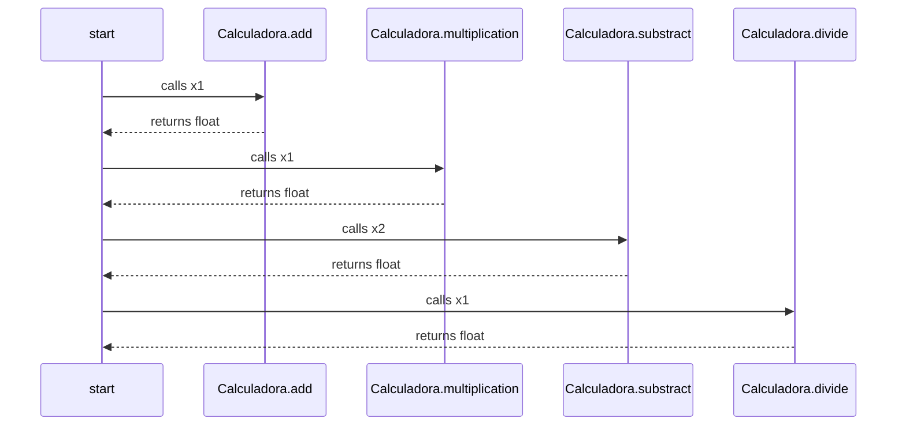

This is a mermaid diagram, you may need to install a [Browser Plugin](https://github.com/BackMarket/github-mermaid-extension) or [VsCode extension](https://marketplace.visualstudio.com/items?itemName=bierner.markdown-mermaid) or similar to view it.

You can also [view it full screen as an SVG](https://mermaid.ink/svg/c2VxdWVuY2VEaWFncmFtCiAgc3RhcnQtPj5DYWxjdWxhZG9yYS5hZGQ6IGNhbGxzIHgxCiAgQ2FsY3VsYWRvcmEuYWRkLS0+PnN0YXJ0OiByZXR1cm5zIGZsb2F0CiAgc3RhcnQtPj5DYWxjdWxhZG9yYS5tdWx0aXBsaWNhdGlvbjogY2FsbHMgeDEKICBDYWxjdWxhZG9yYS5tdWx0aXBsaWNhdGlvbi0tPj5zdGFydDogcmV0dXJucyBmbG9hdAogIHN0YXJ0LT4+Q2FsY3VsYWRvcmEuc3Vic3RyYWN0OiBjYWxscyB4MgogIENhbGN1bGFkb3JhLnN1YnN0cmFjdC0tPj5zdGFydDogcmV0dXJucyBmbG9hdAogIHN0YXJ0LT4+Q2FsY3VsYWRvcmEuZGl2aWRlOiBjYWxscyB4MQogIENhbGN1bGFkb3JhLmRpdmlkZS0tPj5zdGFydDogcmV0dXJucyBmbG9hdAo=)        

